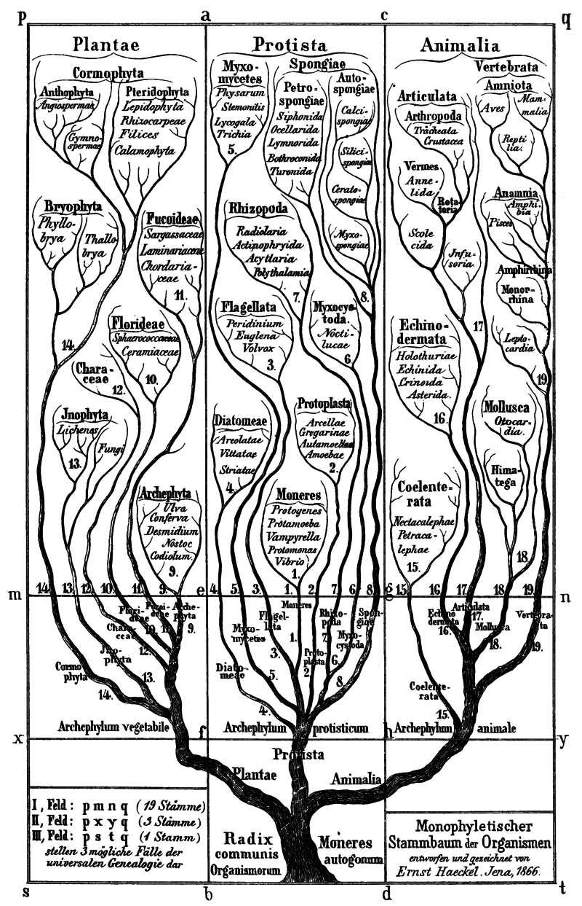
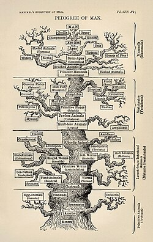
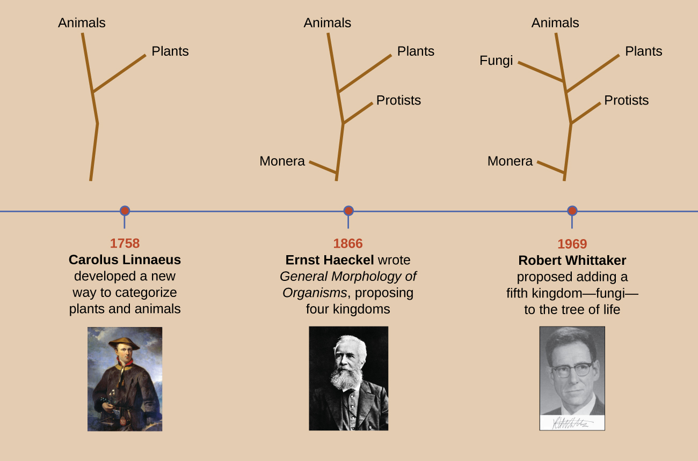
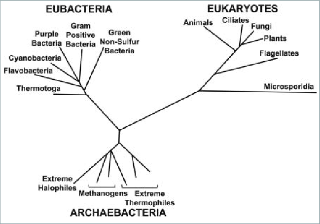

# A Systematic Approach

## Justin N. Howard
### Principles of Biology II · KCTCS · Somerset · Fall 2025

---

# A Systematic Approach to Microorganisms

Once revealed by microscopes, microorganisms displayed an incredible diversity in size, appearance, and reproduction rates.  

A systematic approach became essential to categorize this diversity.

---

# The Science of Taxonomy

**Taxonomy** – the science of classifying living organisms.  

- Involves categorizing organisms based on shared characteristics.  
- Provides a framework for studying evolutionary relationships.  

---

# Carolus Linnaeus (1707–1778)

Swedish botanist, zoologist, and physician.  
Pioneering taxonomist whose *Systema Naturae* laid the foundation for modern classification.  

_in_his_Lapland_costume_-_painting.jpg)

---

# Linnaeus's Taxonomic Hierarchy

- Divided the natural world into **kingdoms, classes, orders, families, genera, and species**.  
- Species = most specific level.  
- His original system included animals, plants, and minerals (the mineral kingdom later dropped).  

---

# Binomial Nomenclature

- Two-word naming system: **genus + specific epithet**.  
- Example: *Homo sapiens* (humans).  
- Provides a unique, universally recognized name for each organism.  

---

# Evolving Trees of Life

**Phylogenetic trees** (trees of life) illustrate evolutionary relationships among species.  

- Initially based on morphology (visible characteristics).  
- Now incorporate genetic, biochemical, and embryological comparisons.  

---

# Charles Darwin and the Voyage of the Beagle

- Charles Darwin (1809–1882), English naturalist.  
- Spent 5 years (1831–1836) aboard **HMS Beagle** collecting specimens and making observations.  
- The **Galápagos Islands** provided key insights into variation, adaptation, and species divergence.  
- His observations became the foundation for the theory of evolution by natural selection.  

---

# Key Concepts in Evolution

- **Adaptation** – A heritable trait that improves survival or reproduction.  
- **Natural Selection** – Process by which individuals with advantageous traits leave more offspring.  
- **Selective Pressure** – Environmental factor that influences which traits increase survival and reproduction.  
  - Examples: predators, climate, disease, food availability.  
- Over generations, populations change as favorable traits accumulate.  

---

# Thomas Malthus (1766–1834)

- English economist who wrote *An Essay on the Principle of Population* (1798).  
- Proposed that populations grow faster than food supply.  
- Result: competition for limited resources.  
- Darwin later applied this concept to natural selection.

---

# Jean-Baptiste Lamarck (1744–1829)

- Early evolutionary thinker.  
- Proposed **inheritance of acquired characteristics**: traits developed during an organism’s lifetime could be passed to offspring.  
- Example: giraffes stretch necks → offspring inherit longer necks.  
- Though incorrect, Lamarck emphasized the role of adaptation and change over time.  

---

# Ernst Haeckel (1866)

- Proposed **Protista** for unicellular organisms.  
- Later added **Monera** for those without nuclei.  

---

---

---

# Robert Whittaker’s Five-Kingdom System (1969)

- Proposed **Fungi** as a new kingdom.  
- Distinguished between prokaryotes and eukaryotes.  

---

# The Modern Tree of Life

- Continually refined with technological advances.  
- Depicts a more complex and dynamic history of life.  
- Viruses, being non-cellular, pose a unique challenge in their placement.  

---

# The Role of Genetics in Modern Taxonomy

Molecular genetics has revolutionized taxonomy:  

- Allows comparisons based on DNA, RNA, and proteins.  
- Carl Woese’s discovery of **Archaea** led to the **three-domain system**: Archaea, Bacteria, and Eukarya.  

---

---

# Variability Within Species

Even within a single species, like *Escherichia coli*, there are different strains with distinct characteristics.  

- Some strains are pathogenic, such as *E. coli* O157:H7.  
- Others are harmless and beneficial to human gut health.  

---

# Charles Darwin and the Voyage of the Beagle

- Charles Darwin (1809–1882), English naturalist.  
- Spent 5 years (1831–1836) aboard **HMS Beagle** collecting specimens and making observations.  
- The **Galápagos Islands** provided key insights into variation, adaptation, and species divergence.  
- His observations became the foundation for the theory of evolution by natural selection.  

---

# Key Concepts in Evolution

- **Adaptation** – A heritable trait that improves survival or reproduction.  
- **Natural Selection** – Process by which individuals with advantageous traits leave more offspring.  
- **Selective Pressure** – Environmental factor that influences which traits increase survival and reproduction.  
  - Examples: predators, climate, disease, food availability.  
- Over generations, populations change as favorable traits accumulate.  

---

# Similarity and Evolutionary Relationships

Similarity does not always accurately predict evolutionary relationships.  

- Rates of evolution vary.  
- Evolution is not always unidirectional.  
- Evolution is not always divergent.  
- Convergent evolution can produce similar traits in unrelated groups.  

---

# Cladistics

**Cladistics** – an approach to systematics where only shared derived characters are considered informative about evolutionary relationships.  

- **Ancestral characteristic**: inherited from the most recent common ancestor of a group.  
- **Derived characteristic**: arose more recently, shared only by a subset of species.  

---

# Cladistic Method

Characters can be any aspect of the phenotype:  
- Morphology  
- Physiology  
- Behavior  
- DNA  

Characters must exist in recognizable **character states**.  
Example: The character “tail” in vertebrates has two states – present (in most vertebrates) and absent (in humans, apes, and frogs).  

---

# Clades and Cladograms

**Cladogram**  
- Depicts a hypothesis of evolutionary relationships.  

**Clade**  
- Species that share a common ancestor as indicated by the possession of shared derived characters.  
- A clade is an evolutionary unit: it includes a common ancestor and all of its descendants.  
- **Synapomorphy** – a derived character shared by clade members.  

---

# DNA Sequences in Cladograms

Systematists increasingly use DNA sequence data to construct phylogenies because:  
- Sequencing provides a very large number of characters.  
- Character states can be compared and **polarized** by reference to an outgroup.  
- Cladograms are then constructed to minimize the amount of character change required (principle of parsimony).  

---

# Outgroups

**Outgroup** – a species or group that is closely related to, but not part of, the group being studied.  

- Used to determine which character states are ancestral versus derived.  
- Example: if the outgroup has a tail, the “tail present” state is likely ancestral.  
- Outgroup comparison helps root the cladogram and clarify evolutionary direction.  

---

# Synapomorphies vs. Plesiomorphies

## **Plesiomorphy** - Ancestral character state inherited from a distant ancestor.  
### Example: Presence of a tail in vertebrates is ancestral (plesiomorphic). 

---

# Plesiomorphy
### From plesio- (Greek plēsios, meaning “near” or “close”)

### And -morphē (Greek morphē, “form” or “shape”)

### Meaning: “near form” — refers to an ancestral trait, a character state close to the original condition of a lineage.

---

## **Symplesiomorphy** - Shared ancestral character state.  
### Example: Tigers, lizards, and sharks all have tails, but this does not imply they are closely related.  

---

# Symplesiomorphy

### From sym- (“together”) + plesiomorphy

### Meaning: “shared ancestral form” — a trait shared because it was present in a distant common ancestor, but not useful for defining smaller, more recent clades.

---

# **Synapomorphy**
### A shared derived character state unique to a clade. 

### Example: Presence of hair in mammals is a synapomorphy that unites all mammals.  

---

# **Apomorphy**
### From apo- (Greek apo, “away from” or “derived from”)
### And -morphē (“form”)
### Meaning: “away form” — a derived trait that is new relative to the ancestral state.

---

# Synapomorphy
### From syn- (Greek syn, “together”)
### Plus apomorphy
### Meaning: “shared derived form” — a derived trait present in two or more taxa and their most recent common ancestor. 

# **This is what defines a clade.**

---

## In a broad clade comparison (say, vertebrates vs. invertebrates), lungs could be considered a **synapomorphy** uniting tetrapods (amphibians, reptiles, birds, mammals). They are a derived feature compared with the lungless fish ancestors.

---

## But if your focus is within mammals only, lungs become a **plesiomorphy**, because they are already present in earlier ancestors (shared with amphibians and reptiles) and do not uniquely describe mammals.

