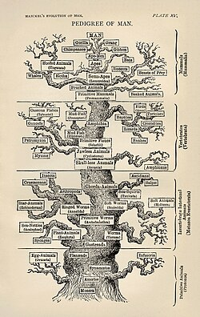
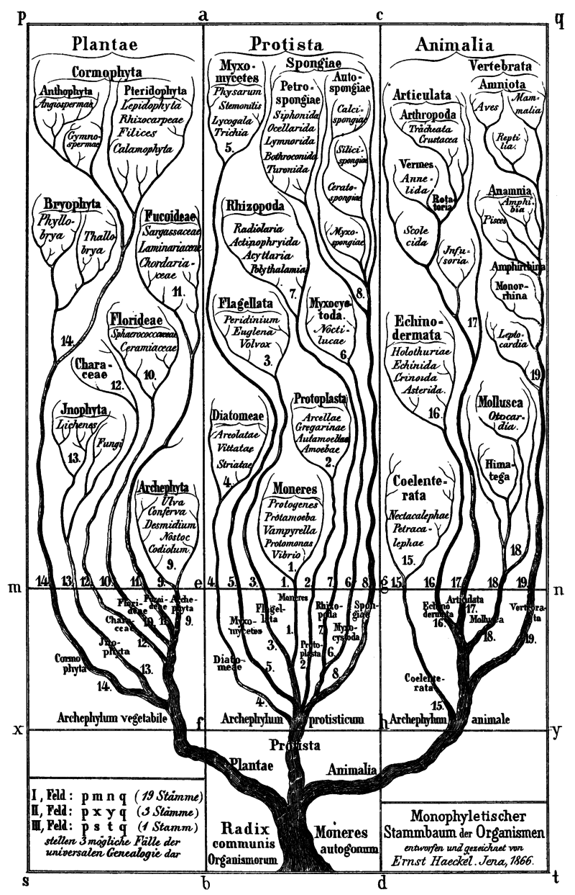

# A Systematic Approach

###### Fall 2025
Justin N. Howard
KCTCS · Somerset

---

## A Systematic Approach to Microorganisms

- Let's understand how microorganisms, once revealed by microscopes, displayed an incredible diversity in size, appearance, and reproduction rates.
  
  

- We'll explore the necessity of a systematic approach to categorize this diverse array of organisms.
  
---
## The Science of Taxonomy

- Taxonomy, the science of classifying living organisms, involves categorizing organisms based on shared characteristics.
  
---

## **Carolus Linnaeus** (1701–1778), a Swedish botanist, zoologist, and physician, was a pioneering taxonomist. His work, *Systema Naturae*, laid the foundation for modern taxonomic categorization.

_in_his_Lapland_costume_-_painting.jpg)

---

# Linnaeus's Taxonomic Hierarchy

## Linnaeus's system divided the natural world into **kingdoms, classes, orders, families, genera**, and **species**, with species being the most specific level.

### His original taxonomy included three kingdoms: animal, plant, and mineral, though the mineral kingdom was later dropped.

---

# Evolving Trees of Life - Phylogenies

## Phylogenetic trees, or trees of life, illustrate the evolutionary relationships among different species.
  
## Initially based on *morphology* (visible characteristics), these trees now incorporate genetic, biochemical, and embryological comparisons.

---

# Ernst Haeckel and the Kingdom Protista

## In 1866, Ernst Haeckel, a German biologist, proposed the kingdom Protista for unicellular organisms, and later, Monera for unicellular organisms without nuclei.

---

---

---

# Robert Whittaker's **Five-Kingdom System**

## American ecologist Robert Whittaker (1920-1980) expanded the tree of life in 1969, proposing the kingdom Fungi and distinguishing between prokaryotes and eukaryotes.
  
---

# The Modern Tree of Life

## Today's taxonomy is continually refined with technological advances, depicting a more complex tree of life.
  
## Viruses, being non-cellular, pose a unique challenge in their placement within this tree.

---

---

## The Role of Genetics in Modern Taxonomy

# Molecular genetics has revolutionized taxonomy, allowing comparisons based on DNA, RNA, and proteins.
# Carl Woese's discovery of archaebacteria led to a three-domain system: Archaea, Bacteria, and Eukarya.
  
---

---

# Naming Microbes - Binomial Nomenclature

## Linnaeus's binomial nomenclature system uses a two-word naming format: the genus and specific epithet, like *Homo sapiens* for humans.
  
## This system provides a unique, universally recognized name for each organism.

---

# Variability Within Species - *E. coli* Strains

# Even within a single species, like *Escherichia coli*, there are different strains with distinct characteristics.

# While some *E. coli* strains are pathogenic, like *E. coli* O157:H7, others are harmless and beneficial to human gut health.
