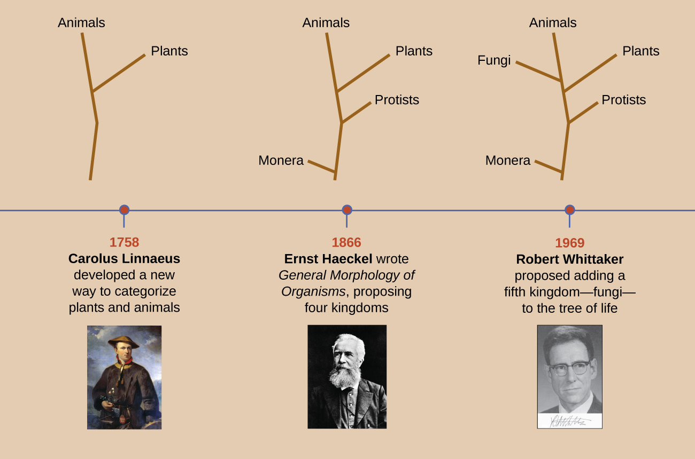
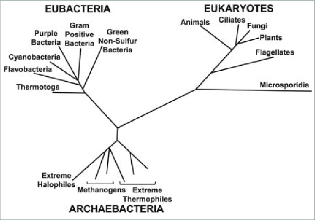

---

_in_his_Lapland_costume_-_painting.jpg)
Wearing the traditional dress of the Sami people of Lapland, holding the twinflower, later known as Linnaea borealis, that became his personal emblem. Martin Hoffman, 1737.

 By Martin Hoffman - <a href="https://en.wikipedia.org/wiki/en:Naturalis_Biodiversity_Center" class="extiw" title="w:en:Naturalis Biodiversity Center">Naturalis Biodiversity Center</a>, Public Domain, <a href="https://commons.wikimedia.org/w/index.php?curid=44204832">Link</a>

---

[[File:Naturalis Biodiversity Center - Martin Hoffman - Carl von Linné (Linnaeus) in his Lapland costume - painting.jpg|thumb|Naturalis Biodiversity Center - Martin Hoffman - Carl von Linné (Linnaeus) in his Lapland costume - painting|alt=File:Naturalis Biodiversity Center - Martin Hoffman - Carl von Linné (Linnaeus) in his Lapland costume - painting.jpg]]

---

Árbol de la vida según Haeckel, E. H. P. A. (1866).Generelle Morphologie der Organismen : allgemeine Grundzüge der organischen Formen-Wissenschaft, mechanisch begründet durch die von C. Darwin reformirte Decendenz-Theorie. Berlin.

---

Figure  4.3.1.3
 : This timeline shows how the shape of the tree of life has changed over the centuries. Even today, the taxonomy of living organisms is continually being reevaluated and refined with advances in technology.

https://bio.libretexts.org/Courses/Prince_Georges_Community_College/PGCC_Microbiology/04%3A_Microscopy_Staining_and_Classification/4.03%3A_Classification_and_Identification/4.3.01%3A_Kingdom_Classification_According_to_Whittaker?utm_source=chatgpt.com

https://bio.libretexts.org/@api/deki/files/8266/OSC_Microbio_01_02_TreesTIME.jpg?revision=1&size=bestfit&width=859&height=568

---

https://www.pnas.org/doi/epdf/10.1073/pnas.97.15.8392

